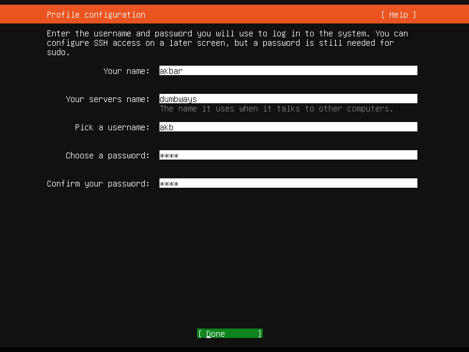

# Introduction to DevOps

Pengenalan DevOps dan Instalasi Ubuntu Server 22.04 pada Virtualbox.
pada kali ini saya akan menjelaskan:

    1. Istilah "Continuous" pada DevOps
    2. Instalasi Ubuntu Server 22.04 di Virtualbox
    3. Instalasi Nginx WebServer pada VM yang telah dibuat

# A. Continuous pada DevOps
## 1. Continuous Delivery (CD)
Merupakan serangkaian proses dan tindakan yang mengotomatisasi tahapan Software Development Life Cycle (SDLC) dari tahap build sampai testing, dengan demikian akan memungkinkan putaran umpan balik yang cepat antara bisnis dan user. Bersamaan dengan Continuous Integration (CI), CD membentuk pipeline delivery modern disebut sebagai CI/CD.

## 2. Continuous Deployment (CDE)
Continuous deployment memungkinkan tim development untuk mengintegrasikan segmen program ke production environment beberapa kali per hari. Ini merupakan versi otomatis dari continuous delivery.

## 3. Continuous Improvement
Merupakan filosofi dengan tujuan membuat kultur yang memungkinkan setiap orang dalam tim untuk membuat atau mengusulkan peningkatan ke sebuah produk atau proses pada waktu tertentu.

## 4. Continuous Integration (CI)
CI adalah praktek pengembangan software di mana developer diperlukan untuk mengintegrasikan kode program ke repositori yang dibagikan beberapa kali per hari dengan tujuan mendapatkan umpan balik yang cepat. Bersamaan dengan Continuous Delivery, CI membentuk pipeline delivery modern yang disebut CI/CD.

## 5. Continuous Quality Improvement (CQI)
CQI adalah filosofi pengelolaaan kualitas yang digunakan organisasi untuk mengurangi limbah, meningkatkan efisiensi, dan meningkatkan keyakinan baik di internal maupun eksternal organisasi.

## 6. Continuous Testing 
Continuous testing bertujuan untuk mengurangi waktu tunggu bagi developer dengan melakukan pengujian lebih awal dan lebih sering, serta mengotomatisasi proses itu sebanyak mungkin.

<br><br>

# B. Instalasi Ubuntu Server 22.04 pada Virtualbox
## 1. Download Disk Image dan Installer
Alat yang diperlukan dapat diunduh di sini:

[Ubuntu Server 22.04 **(.iso)** 👇](https://ubuntu.com/download/server)


[Virtualbox v7.1.6 ⬇️](https://www.oracle.com/id/virtualization/technologies/vm/downloads/virtualbox-downloads.html)


## 2. Install Virtualbox seperti menginstal aplikasi biasa


## 3. Buat Virtual Machine dengan klik **New**:


Berikut konfigurasi Virtual Machine untuk Ubuntu Server. Pada field ISO image bisa diimport disk image Ubuntu yang telah didownload. Checklist "Skip Unattended Installation" karena tidak menggunakan akun bawaan yang dibuatkan Virtualbox. 


Konfigurasi besarnya RAM dan jumlah CPU:


Konfigurasi Virtual Hard Disk. Klik Next, lalu Finish


Konfigurasi Network adapter:


Hasil konfigurasi Virtual Machine:


## 4. Instal Ubuntu Server di Virtual Machine
Menjalankan Virtual Machine yang diinstal di langkah sebelumnya dengan klik "Start":


Untuk instalasi Ubuntu Server pilih opsi pertama:


Pilih English untuk bahasa instalasi --> Tekan Enter:


Diberikan opsi untuk update sistem, pilih "Continue without updating" karena belum diperlukan update sistem:


Memilih English (US) untuk "Keyboard Configuration":


Memilih tipe instalasi "Ubuntu Server" dan bukan minimized. Sebab untuk versi minimized memiliki fungsional yang terbatas atau secukupnya saja.


Pada bagian ini arahkan pointer ke port enp0s3 ➡️ Edit IPv4 ➡️ pilih IPv4 Method = Manual ➡️ pilih Save


Melakukan konfigurasi jaringan di Ubuntu Server:
- IPv4 Method  = Manual
- Subnet = 192.168.1.0/24
- Address = 192.168.1.9
- Gateway = 192.168.1.1
- Name Server = 8.8.8.8, 8.8.4.4
  
Subnet disesuaikan dengan jaringan yang digunakan komputer fisik. Jika menggunakan Windows dapat dicek dengan cmd dan mengetikkan "ipconfig". Name server digunakan dari Google karena beberapa ISP memblokir Name Server dari Cloudflare. Dan disetting 2 IP address sebagai antisipasi jika salah satu sedang trouble tetap ada alternatif satunya.


Simpan konfigurasi jaringan dengan pilih Save ➡️ pilih Done


Selanjutnya diberikan konfigurasi proxy bisa diabaikan dengan pilih Done
Selanjutnya diberikan konfigurasi Mirror Ubuntu bisa diabaikan dengan pilih Done

Pada konfigurasi Storage, pilih "Custom storage layout" dengan mengarahkan pointer ke tanda "( )" dan tekan spasi untuk memilih itu ditandai dengan tanda "X" ➡️ pilih Done


Arahkan pointer ke free storage (9.9989GB) ➡️ Enter ➡️ pilih "Add GPT Partition". Mengatur konfigurasi partisi storage seperti gambar berikut (Size 7G=7GB) ➡️ pilih "Create".


Melakukan partisi kedua sesuai dengan langkah sebelumnya namun partisi dikonfigurasi seperti gambar berikut. Storage ditentukan sebesar 2.8G = 2.8 GB dan format swap. Partisi ini berfungsi untuk menampung beban kerja RAM sementara jika di RAM sudah berlebihan dan akan dikembalikan ketika beban kerja di RAM sudah tidak padat lagi.


Akhir dari konfigurasi storage seperti gambar berikut ➡️ pilih Done untuk melanjutkan.


Pilih "Continue" untuk melanjutkan jika server baru dijalankan / masih kosong. Apabila terdapat data yang pernah disimpan pada disk sebaiknya sudah dilakukan backup sebelumnya.


Konfigurasi profil seperti pada gambar berikut.
- Your name = akbar
- Your servers name = dumbways
- Pick a username = akb
- Choose a password = 1234
- Confirm your password = 1234
  



Pilih Skip for Now:


Skip SSH Configuration saat ini karena hanya akan menginstal Ubuntu kosongan:


Skip Feature server snap ➡️ Done


Proses instalasi dimulai, menunggu hingga proses selesai.


Berikut tampilan ketika instalasi selesai ➡️ Pilih "Reboot Now"


Menunggu hingga ada prompt login seperti ini dan menginputkan username dan password yang telah dibuat sebelumnya:


Jika berhasil login maka tampilannya sebagai berikut.


## 5. Uji Koneksi di Ubuntu Server
Uji koneksi internet dengan eksekusi perintah berikut pada terminal
```
ping 8.8.8.8
```

Berdasarkan gambar di atas diketahui bahwa ada response dari 8.8.8.8 (Name Server Google) yang menandakan koneksi internet berhasil.

Melakukan update package Ubuntu dengan eksekusi perintah berikut.
```
sudo apt update
```

Dari gambar di atas diketahui bahwa update package berhasil.


# C. Instal Nginx WebServer pada Ubuntu di VM 
## 1. Update Package
```
sudo apt update
```


## 2. Install Nginx
```
sudo apt install nginx
```
Akan muncul confirm prompt input "y" dan tekan Enter untuk melanjutkan instalasi


Proses instalasi:


Instalasi Nginx berhasil:


## 3. Cek Status Service Nginx
```
service nginx status
```

Gambar di atas menandakan bahwa status service nginx sudah "loaded" dan aktif

## 4. Percobaan Akses Nginx Web Server dengan Browser
Buka browser dan kunjungi URL dari web server di Ubuntu Server (192.168.1.9)

Sebelah kiri alamat URL tertulis "Not Secure" untuk saat ini dapat diabaikan sebab web server ini hanya menggunakan protokol <code>http</code>. Jika protokol yang digunakan <code>https</code> maka tulisan tersebut tidak akan ada.

Jika Web server tidak dapat menampilkan hasil bisa jadi firewall di Ubuntu (Ubuntu Firewal / UFW) telah aktif dan agar request ke web server dapat melalui firewal maka layanan Nginx itu harus di-"allow" terlebih dahulu.
```
sudo ufw allow 'Nginx Full'
```
Kebetulan pada setup ini ufw sedang tidak aktif:


## 5. Modifikasi Halaman Static Nginx (Opsional)
```
sudo nano /var/www/html/index.nginx-debian.html
```

Simpan perubahan dengan tekan <code>Ctrl + X</code> dan confirm "y"

Akses ulang web server dan hasilnya sebagai berikut:


# Terima Kasih 🙏
## Referensi:

[Continuous DevOps](https://www.planview.com/resources/articles/devops-terminology/)

[Instalasi Nginx](https://www.youtube.com/watch?v=nxvNSPyhMOE)
