# Basic Shell & Networking

## 📝 Tasks: 
    1. Buat diagram jaringan komputer dengan 4 device dengan kondisi:
    - IP Class : 192.168.11.xxx
    - CIDR Block : 192.168.11.0/30
  
    2. Jelaskan Perbedaan antara SH (Shell) dan BASH (Bourne-Again Shell)
   
    3. Buat dokumentasi/kumpulan command Linux yang diketahui!
   

## Diagram Jaringan Komputer (IP Class:192.168.11.xxx dan CIDR: 192.168.11.0/30)

Dengan CIDR <code>/30</code> maka jumlah alamat IP pada subnet adalah 2<sup>32-30</sup> = 2<sup>2</sup> = <b>4 alamat IP</b> dan dialokasikan sebagai berikut:

    1. Alamat Jaringan: 192.168.11.0 ➡️ Tidak dapat digunakan perangkat
    2. Alamat Host 1: 192.168.11.1 ➡️ Dapat digunakan perangkat
    3. Alamat Host 2: 192.168.11.2 ➡️ Dapat digunakan perangkat
    4. Alamat Broadcast: 192.168.11.3 ➡️ Tidak dapat digunakan perangkat.

Dengan demikian tidak dapat menghubungkan 4 device dengan konfigurasi IP dan CIDR tersebut. Jika perlu menghubungkan 4 device dalam 1 jaringan maka dapat menggunakan <b>CIDR Block = /29</b>. Sehingga jumlah alamat IP yang dapat digunakan untuk menghubungkan perangkat adalah sebagai berikut:
### 2<sup>32-29</sup> - 2 = 2<sup>3</sup> - 2 = 8 - 2 = 6 alamat IP
Catatan: Jumlah IP harus dikurangi 2 (-2) karena dalam 1 subnet tersebut terdapat 2 alamat yang tidak dapat digunakan device yaitu Alamat Jaringan dan Alamat Broadcast.
### Diagram Jaringan:
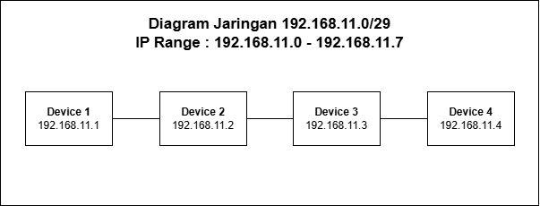


## Perbedaan Shell (sh) dan Bourne-Again Shell (bash)

### Shell (sh)
<code>sh</code> adalah shell standar POSIX yang awalnya dikenal sebagai Bourne Shell dan digunakan pada sistem UNIX atau UNIX-like. Ini merupakan spesifikasi bahasa shell, bukan implementasi langsung, dan banyak digunakan karena portabilitas tinggi. Sebagian besar sistem UNIX menjamin keberadaan <code>sh</code>, sehingga cocok untuk skrip lintas platform.

### Bourne-Again Shell (bash)
<code>bash</code> adalah pengembangan dari <code>sh</code> yang menjadi shell default di banyak distribusi Linux. Bash merupakan superset dari <code>sh</code>, mendukung semua fitur <code>sh</code> ditambah fitur tambahan seperti kontrol pekerjaan, ekspansi brace, dan manipulasi direktori. Bash lebih cocok untuk penggunaan interaktif maupun scripting yang kompleks.

## Command Linux & Dokumentasi


Memperbarui list package:
```
sudo apt update
```
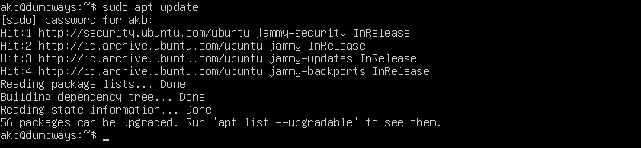

Upgrade semua package (tidak dilanjutkan, hanya demonstrasi):
```
sudo apt upgrade
```
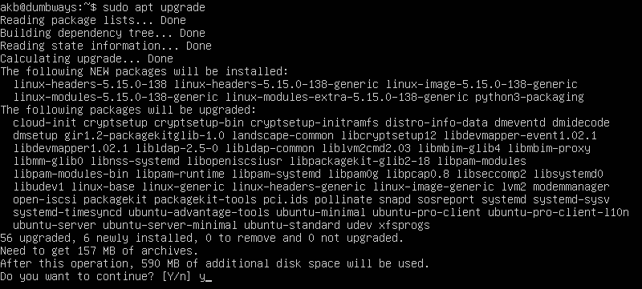

Buat direktori "dumbways" dan lihat isi dari direktori:
```
mkdir dumbways
ls
```
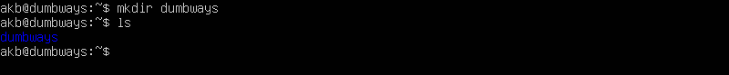

Buat file baru dengan nama "file1":
```
touch file1
```
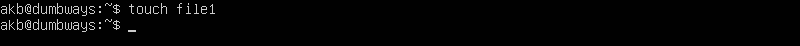

Menampilkan list isi direktori dengan detail:
```
ls -la
```


Pindah direktori (dumbways):
```
cd dumbways
```
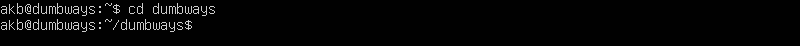

Pindah direktori satu level di atas direktori aktif:
```
cd ..
```
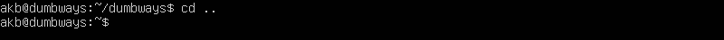


Pindah direktori hidden (direktori hidden terdapat tanda titik di awal nama direktori):
```
cd .ssh
```
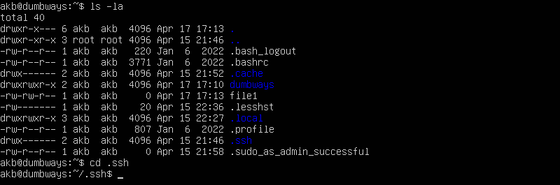

Menyalin file:
```
cp file1 file2
```
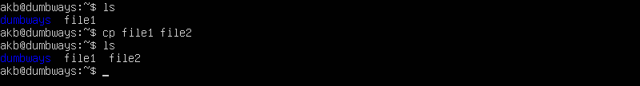

Memindahkan file:
```
mv file1 dumbways/file1
```
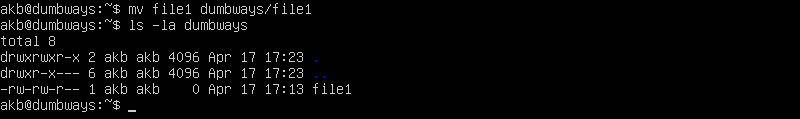

Mencetak teks langsung ke terminal:
```
echo "hello dumbways"
```
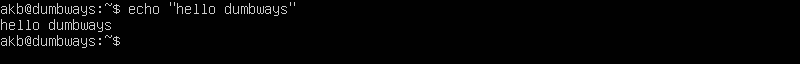

Memasukkan teks ke sebuah file. Jika file sebelumnya sudah terisi maka teks yang dimasukkan akan menimpa/mengganti isi dari file tersebut. Jika ingin melihat hasilnya dapat menggunakan command <code>cat</code>:
```
echo  "hello dumbways" >  file.js
cat file.js
```
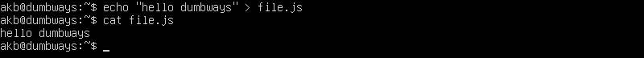


Menambahkan teks ke file yang sudah terisi:
```
echo  "hello DevOps" >> file.js
cat file.js
```
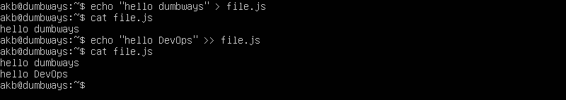


Menunjukkan yang berupa direktori:
```
find -type d
```
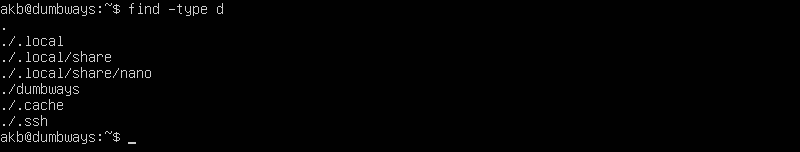

Menunjukkan yang berupa file:
```
find -type f
```
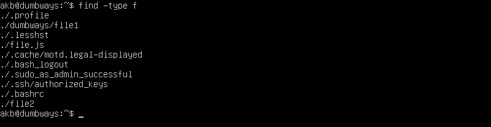

Mencari file dengan nama spesifik:
```
find -type f -name file1 
```
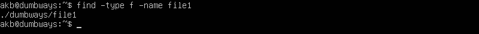

Mencari teks di dalam file:
```
grep hello file.js
```
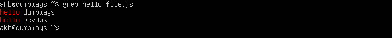

Mengedit isi file dengan teks editor (nano):
```
nano file2
```
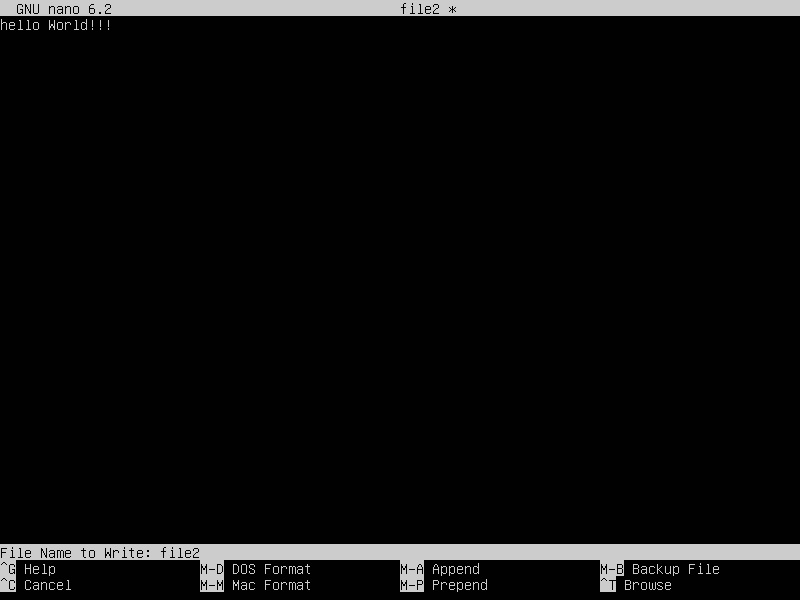

Mencari teks di setiap file pada suatu direktori:
```
grep -r hello
```
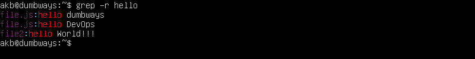

Mengubah permission pada suatu file atau direktori:
```
chmod 777 file.js 
```

Terdapat 3 digit angka sebelum nama file yang menunjukkan permission yang diatur pada file.js. Digit pertama menunjukkan permission yang diberkan kepada <b>user</b>, digit kedua permission kepada <b>group</b>, digit ketiga permission kepada <b>universal/public.</b>. Angka 7 merupakan kombinasi jenis permission yang diizinkan yang disimbolkan dengan angka:

- operasi <code>read</code> disimbolkan angka <b>4</b>
- operasi <code>write</code> disimbolkan angka <b>2</b>
- operasi <code>execute</code> disimbolkan angka <b>1</b>

Jika ketiga jenis permission diberikan maka dijumlahkan <b>4 + 2 + 1 = 7</b>
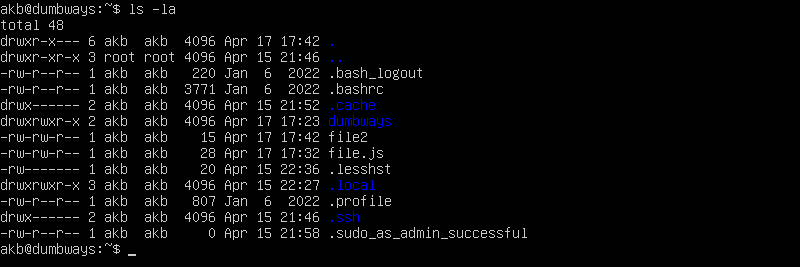
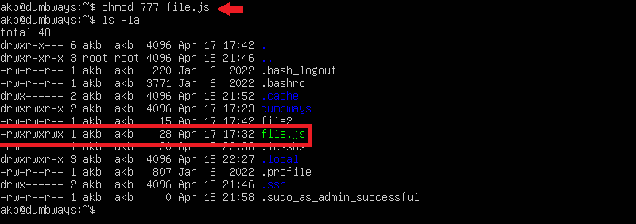

Mengganti kepemilikan file:
```
sudo chown root:root file.js
```
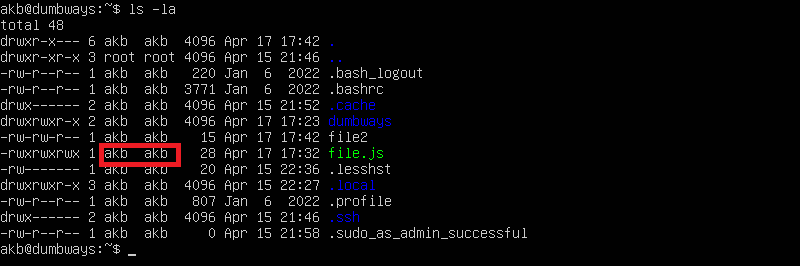
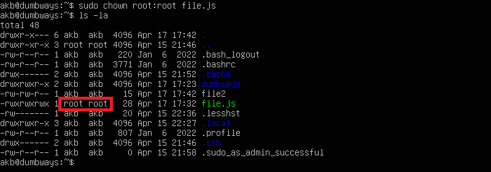

Melihat riwayat command yang pernah dieksekusi:
```
history
```
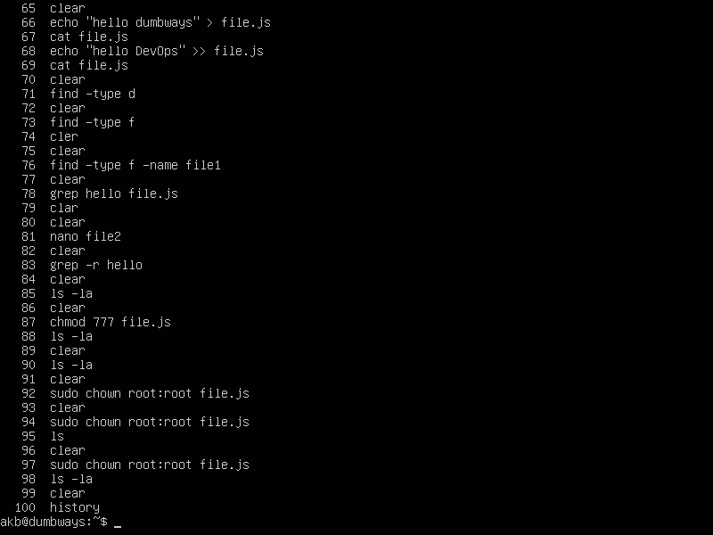

Masuk ke mode root:
```
sudo su
```
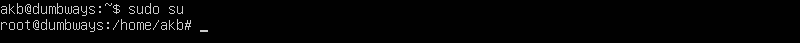

Keluar mode root : 
```
exit
```
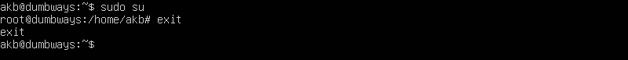

Mencetak path direktori yang sedang aktif:
```
pwd
```
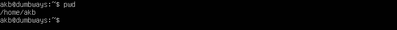


Menghapus file:
```
rm file2
```
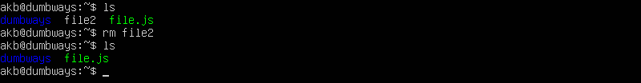

Menghapus direktori beserta isinya:
```
rm -r dumbways
```
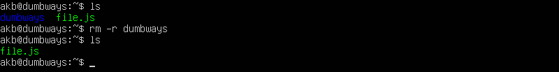


Menampilkan proses yang sedang berjalan:
```
htop
```
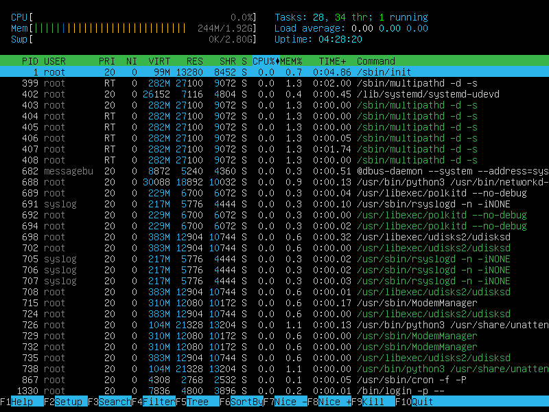
