# Manage Server with Terminal

## Akses Server Menggunakan Windows Terminal 💻

### 1. Cek alamat IP Server
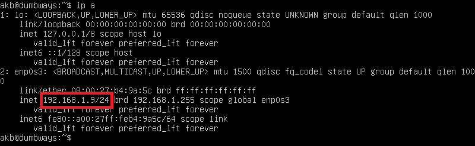

### 2. Buka terminal Windows dan ketik command berikut untuk akses Server di VM
```
ssh <username>@<ip_address>
```
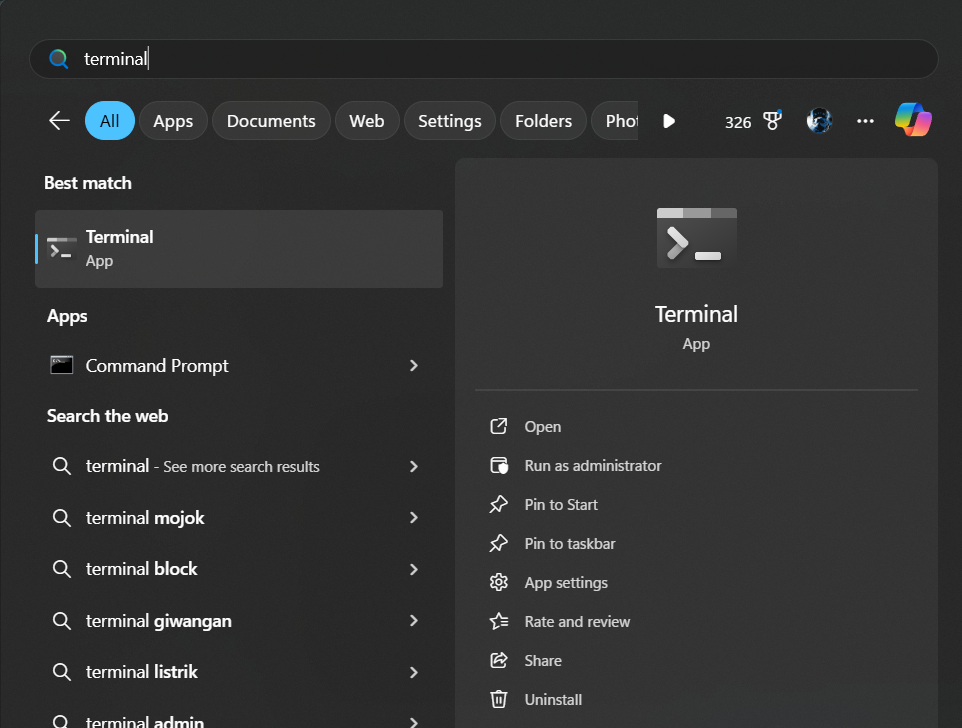
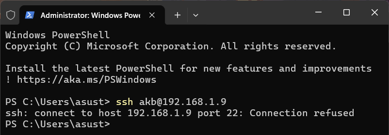

#### Diketahui dari gambar sebelumnya bahwa  koneksi ke server ditolak, sebab OpenSSH belum terinstal di server

### 3. Install OpenSSH di Server
```
sudo apt install openssh-server
```

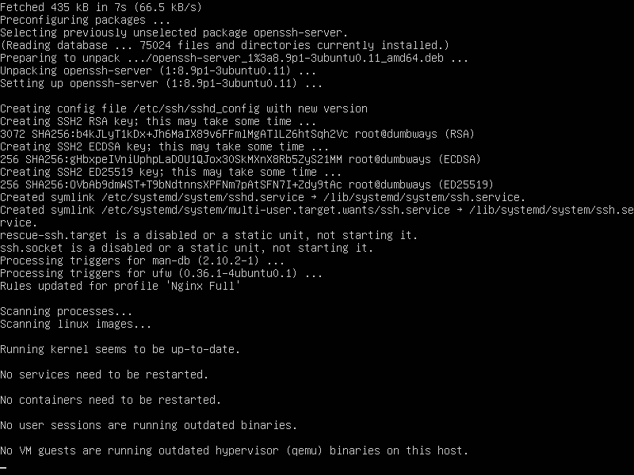

### 4. Ceka apakah SSH sudah running
```
sudo systemctl status ssh
```
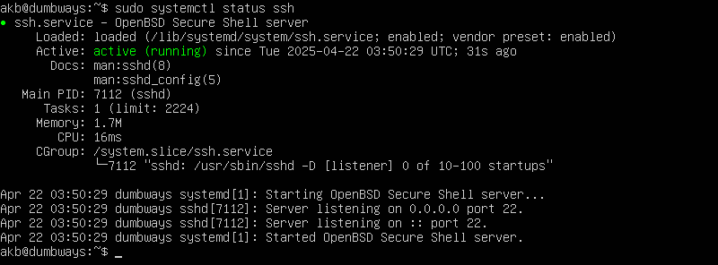

### 5. Kembali ke terminal Windows dan menguji koneksi SSH dengan Server. Password yang digunakan untuk login sama dengan password yang digunakan untuk login di terminal Server
```
ssh akb@192.168.1.9
```
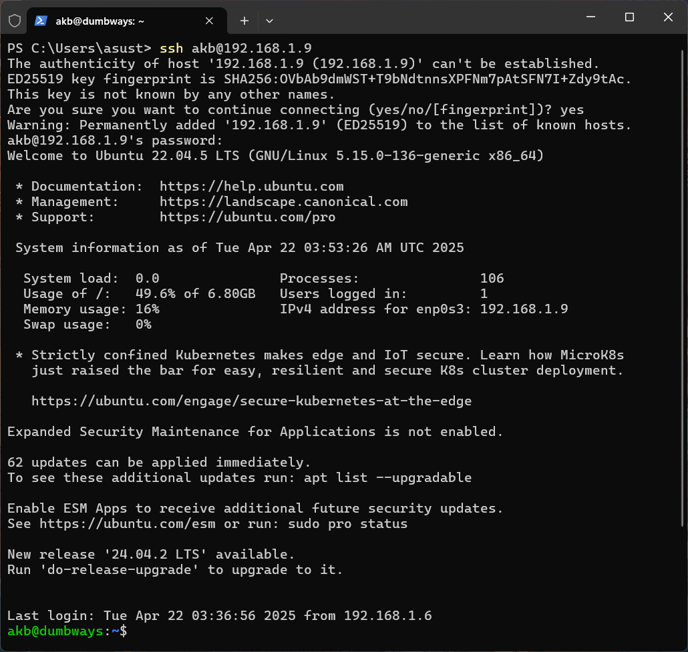

## Konfigurasi Akses SSH Menggunakan Public Key 🔒
### 1. Generate Public Key dan Private Key di Terminal Windows (Nama Key = "kunci_dumbways")
```
ssh-keygen
```
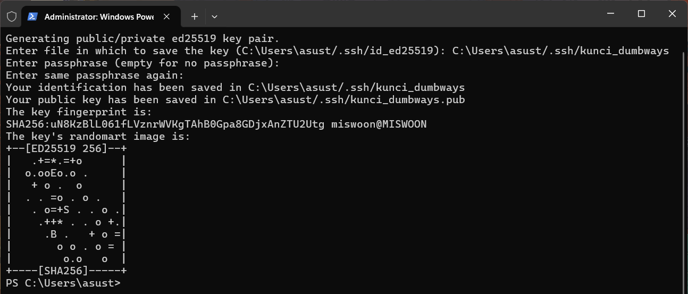

### 2. Buka Folder "C:\Users\<nama_user>\.ssh\" dan terdapat 2 key di mana 1 merupakan Public key (ekstensi .pub) dan 1 lagi Private Key. Private Key harus disimpan baik-baik dan harus dirahasiakan.
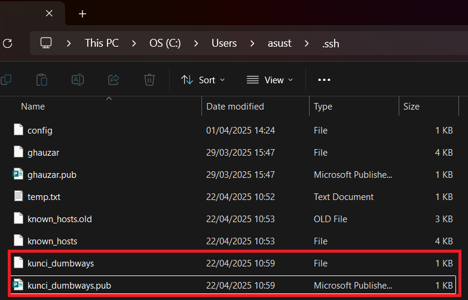

### 3. Buka file Public Key dengan notepad dan salin isinya
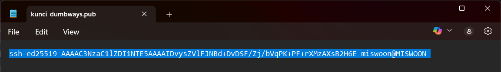

### 4. Login kembali ke server dengan Windows Terminal, dan membuka file "authorized_keys" di direktori ~/.ssh
```
cd .ssh/
ls
sudo nano authorized_keys
```
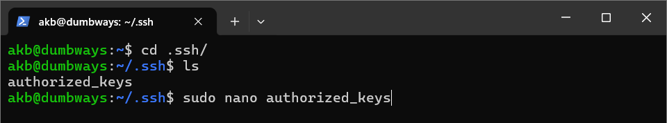

### 5. Paste kan Public Key pada file "authorized_keys" di server Ubuntu dan simpan
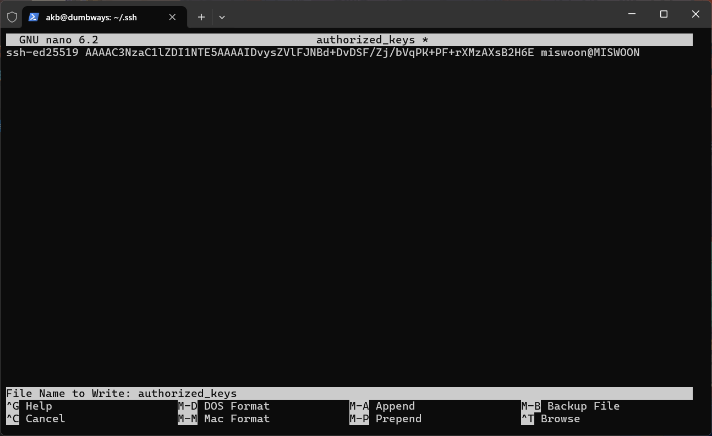

### 6. Uji coba koneksi ke Server dengan SSH menggunakan Public Key di Windows Terminal. Eksekusi command berikut:
```
ssh -i .ssh/kunci_dumbways akb@192.168.1.9
```
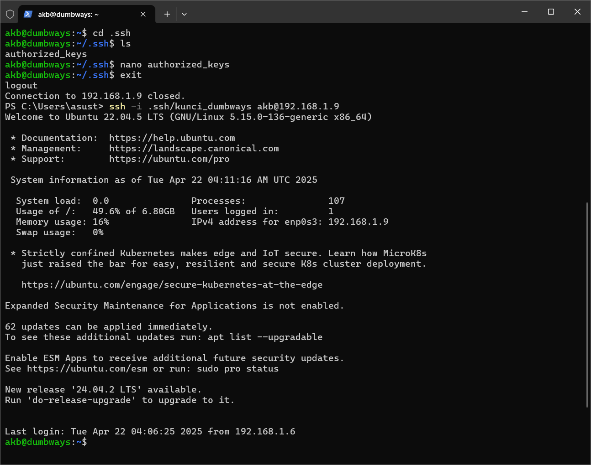

### 7. Agar hanya dapat melakukan login dengan Public Key, maka perlu melakukan konfigurasi pada file konfigurasi SSH
```
sudo nano /etc/ssh/sshd_config
```
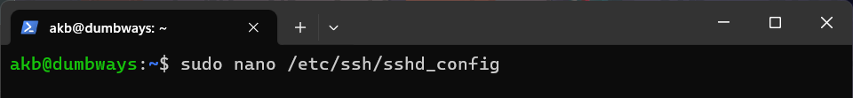

### 8. Atur parameter sebagai berikut. Setelah selesai simpan file tersebut.
    1. PubkeyAuthentication yes
    2. PasswordAuthentication no

- <code>PubkeyAuthentication</code> ➡️ mengizinkan autentikasi via SSH key.
- <code>PasswordAuthentication</code> ➡️ menonaktifkan login via password.

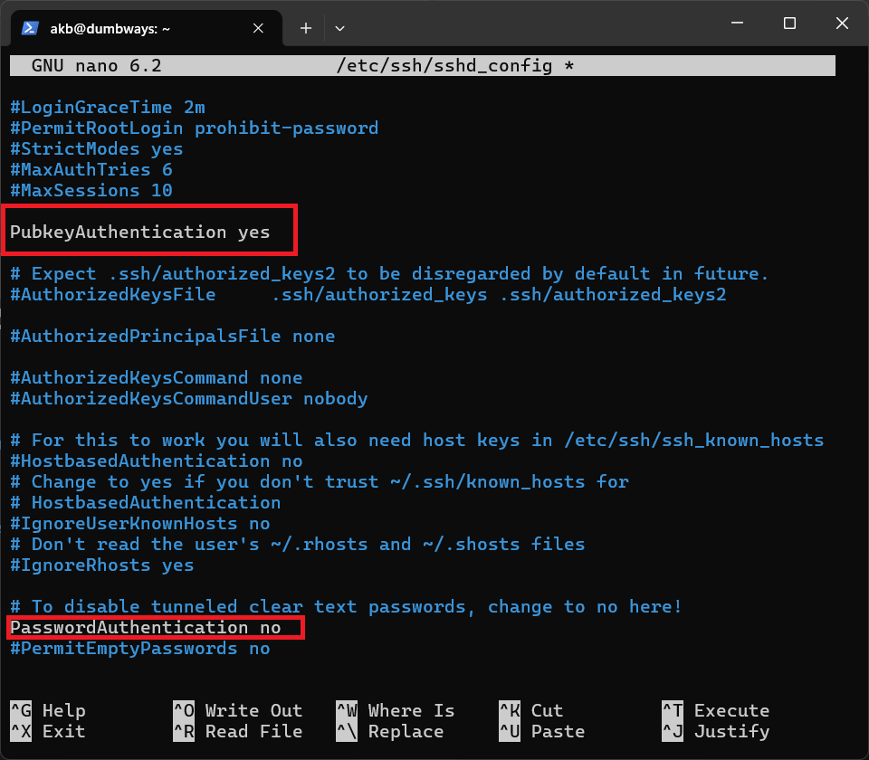


### 9. Restart SSH Service pada terminal
```
sudo systemctl restart sshd
```
### 10. Disconnect SSH dengan mengetikkan "exit" di terminal Windows dan coba login ke Server dengan password:
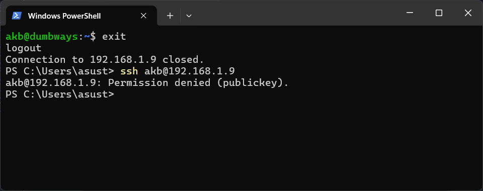

### 11. Diketahui bahwa server menolak login menggunakan password, dan login hanya bisa menggunakan Public Key
```
ssh -i .ssh/kunci_dumbways akb@192.168.1.9
```
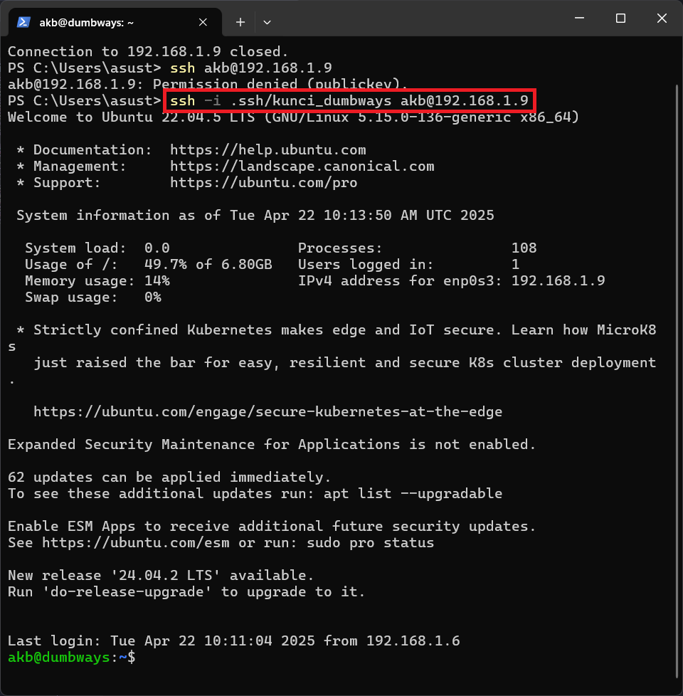


## Text Manipulation (<code>grep</code>, <code>sed</code>, <code>cat</code>, dan <code>echo</code>)

### 1. <code>grep</code>
#### Mencari teks pada file tertentu
```
grep hey file1
```
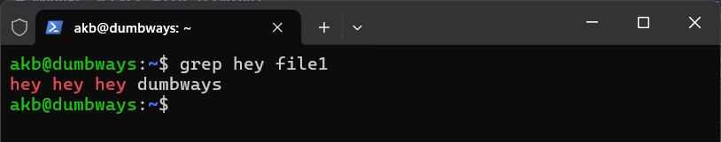


#### Menghitung berapa baris yang mengandung teks sesuai dengan pola teks pada command
```
grep -c hello file3
```
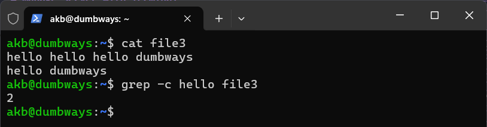

#### Mencari teks yang muncul pada baris dalam setiap file di dalam direktori yang sedang aktif
```
grep hello *
```
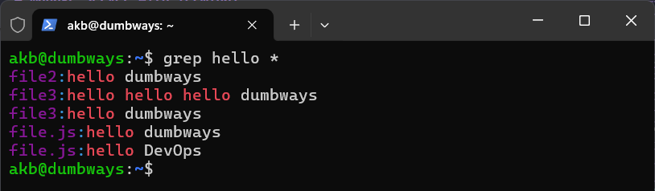

#### Menghitung jumlah baris yang mengandung teks sesuai pola teks command pada setiap file yang terletak di direktori aktif
```
grep -c hello *
```
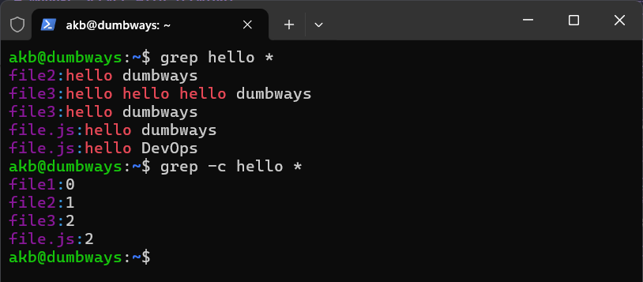


### 2. <code>sed</code>
#### Untuk memanipulasi teks stream
```
sed -i 's/hello/hey/g' file1
```
- <code>sed</code> ➡️ command stream editor, untuk memanipulasi teks
- <code>-i</code> ➡️ <i>in-place edit</i>, artinya file aslinya akan diubah langsung
- <code>'s/hello/hey/g'</code> ➡️ ganti kata "hello" dengan "hey"
- <code>s</code> ➡️ akronim dari <i>substitute</i>
- <code>g</code> ➡️ akronim dari <i>global</i>, ganti semua kemunculan dalam satu baris (bukan hanya yang pertama)
  
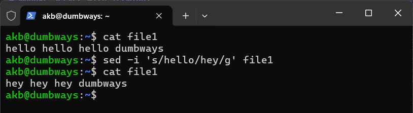

### 3. <code>cat</code>
#### Melihat isi dari suatu file
```
cat file2
```
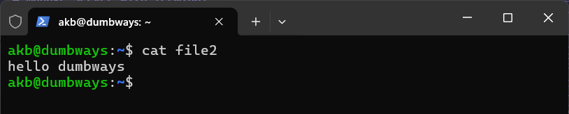

#### Membuat file baru dengan isi sesuai teks yang diinputkan
```
cat > file1
```
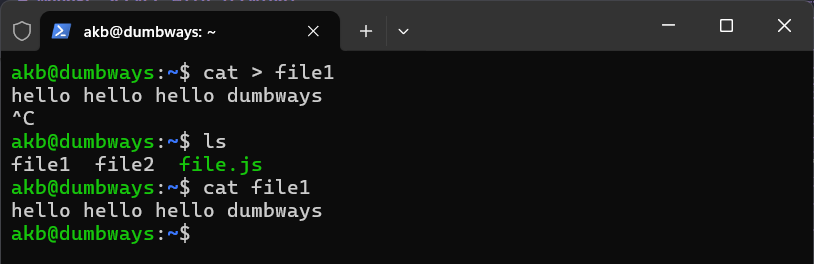

#### Menggabungkan / menyisipkan teks dalam beberapa file ke suatu file
```
cat file1 file2 > file3
```
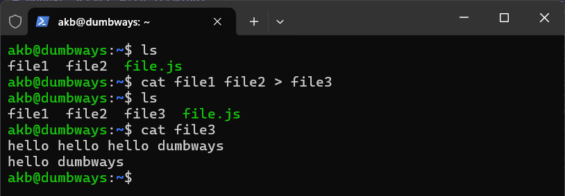


### 4. <code>echo</code>
#### Menampilkan teks biasa
```
echo "Hello Dumbways DevOps"
```
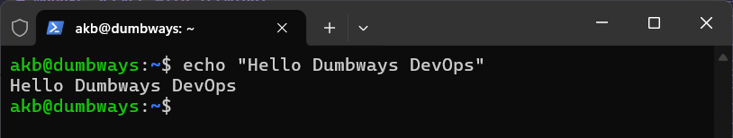

#### Menampilkan isi variabel
```
nama="Akbar"
echo "Nama saya adalah $nama"
```
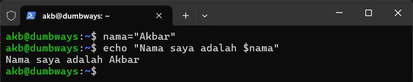

#### Menimpa isi suatu file (overwrite)
```
echo "hai DumbWays" > file1
```
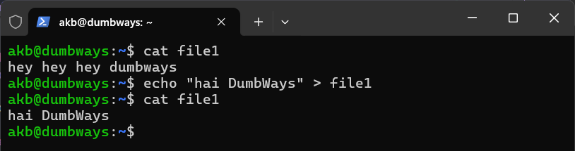

#### Menambahkan teks ke baris baru dari suatu file (append)
```
echo "DevOps DumbWays" >> file3
```
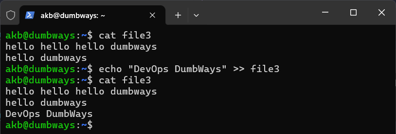


## Menyalakan Uncomplicated Firewall (<code>ufw</code>) dan Manajemen Port
### 1. Menyalakan UFW
```
sudo ufw enable
```
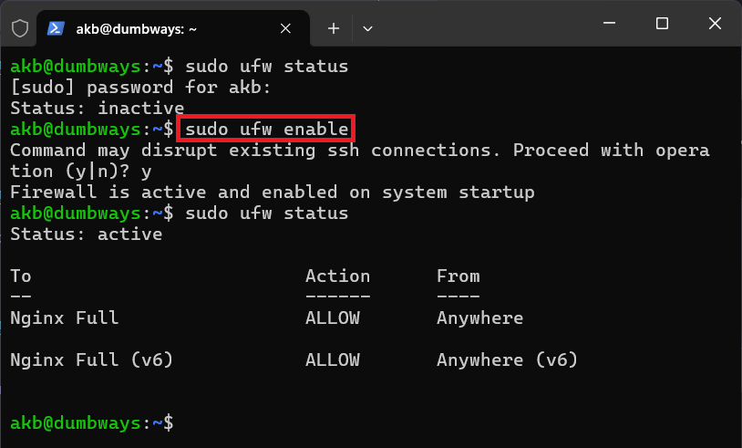


### 2. Mengizinkan OpenSSH
```
sudo ufw allow "OpenSSH"
```
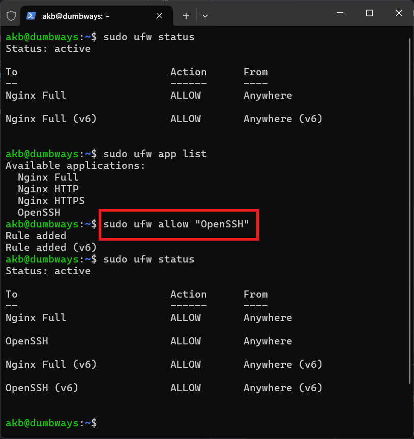


### 3. Mengizinkan Port 22, 80, 443, 3000, 5000, dan 6969
```
sudo ufw allow 22
sudo ufw allow 80
sudo ufw allow 443
sudo ufw allow 3000
sudo ufw allow 5000
sudo ufw allow 6969
```
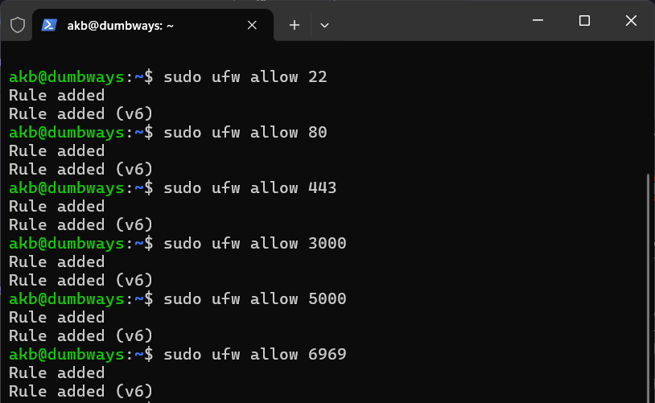
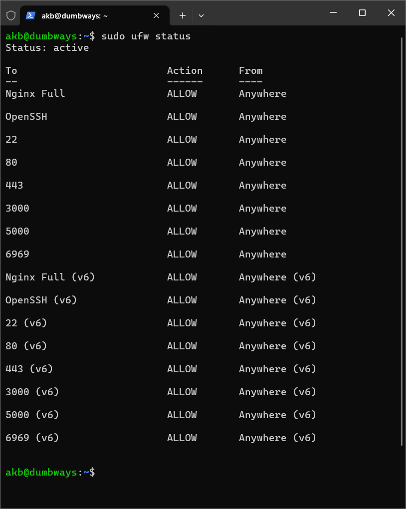
