# Menambahkan Alias <code>'vm-dumbways'</code> untuk Login SSH
## 1. Membuat file <code>config</code> di Direktori 'C:\Users\nama_user\\.ssh'
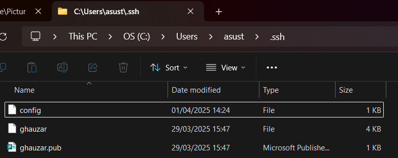

## 2. Buka file <code>config</code> dengan notepad dan menambahkan script berikut kemudian simpan:
```
Host vm-dumbways
    HostName 192.168.1.9
    User akb
    Port 22
    IdentityFile ~/.ssh/kunci_dumbways
```

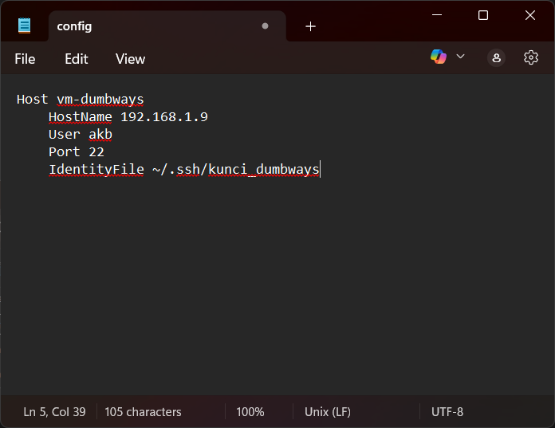

## 3. Buka Windows Terminal ➡️ login SSH dengan command berikut:
```
ssh vm-dumbways
```
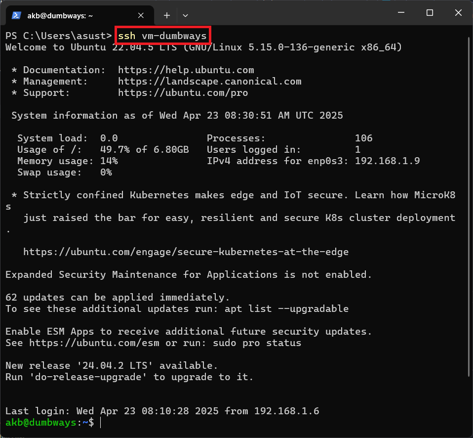

## 4. Dengan demikian maka penambahan alias <code>'vm-dumbways'</code> untuk login ke server berhasil dilakukan


# Mengubah Konfigurasi Port SSH ke 6969
## 1. Buka konfigurasi SSH pada Ubuntu Server dengan text editor <code>nano</code>
```
sudo nano /etc/ssh/sshd_config
```


## 2. Ubah konfigurasi port yang sebelumnya default 22 menjadi 6969. Setelah selesai lalu simpan file konfigurasi tersebut.
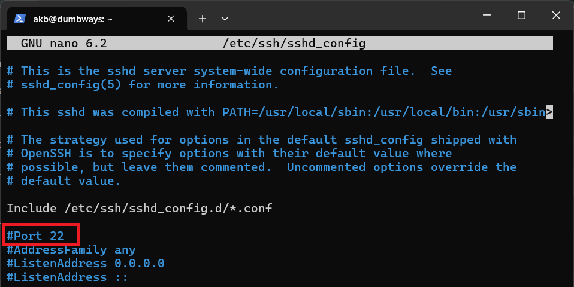


## 3. Restart service SSH:
```
sudo systemctl restart ssh
```
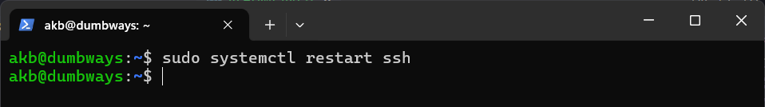

## 4. Logout dari SSH dengan mengeksekusi command <code>exit</code>, lalu masuk kembali
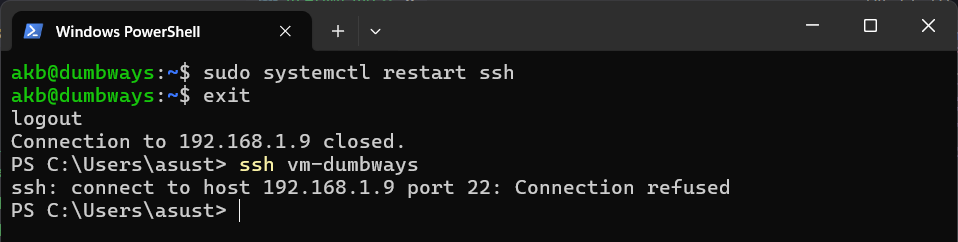

## Diketahui koneksi pada port 22 ditolak, untuk mengatasinya maka diperlukan modifikasi pada file 'C:\Users\nama_user\\.ssh\config' dengan mengubah konfigurasi port dari 22 ke 6969
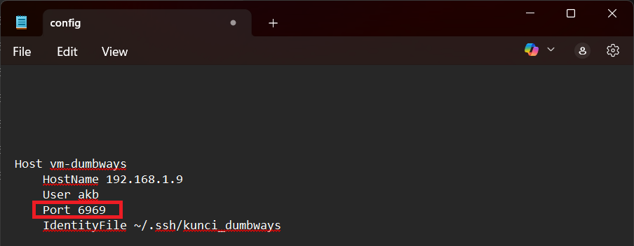

## 5. Simpan file <code>config</code> dan coba login ulang pada SSH Server
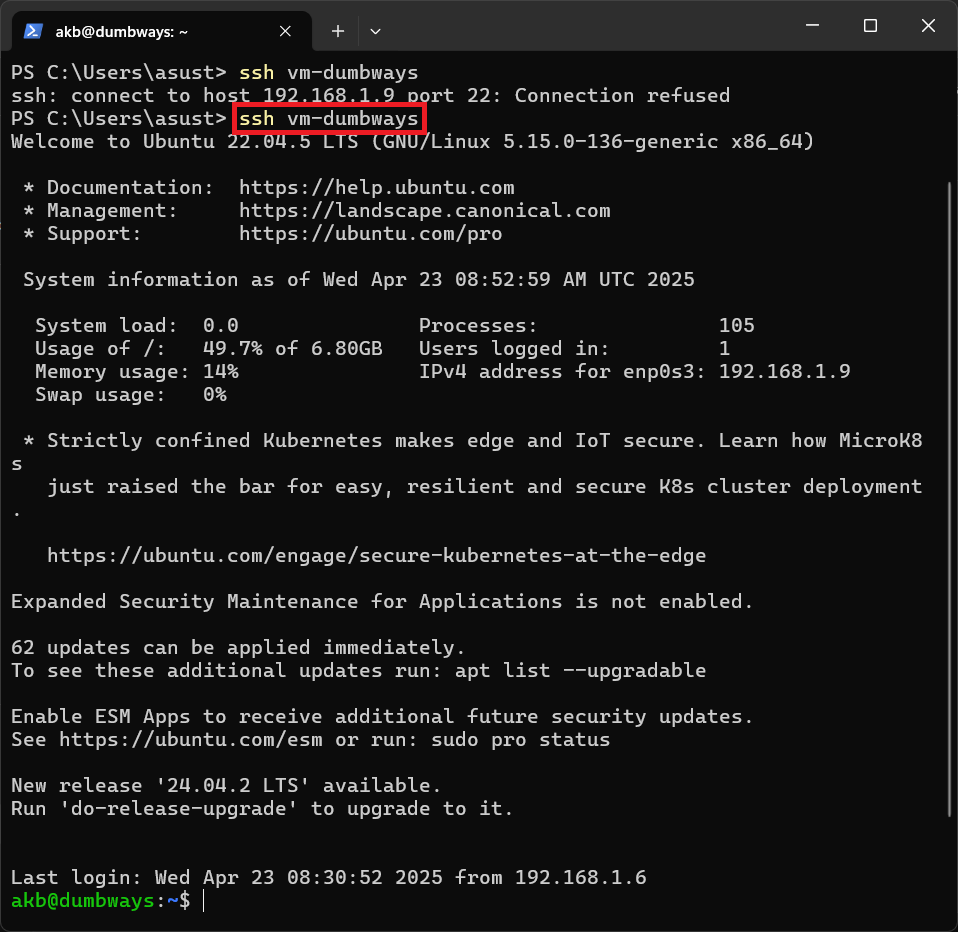


# Pembatasan Akses Server melalui SSH Hanya 1 Device 
## 1. Memastikan Login SSH hanya bisa dilakukan dengan Public Key
```
grep PubkeyAuth /etc/ssh/sshd_config && grep PasswordAuth /etc/ssh/sshd_config
```
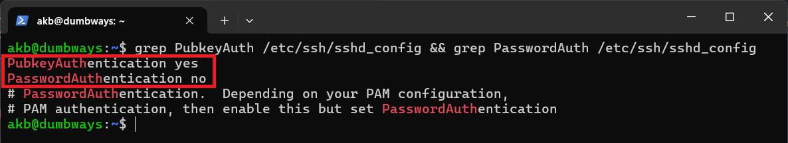

## 2. Hanya menyimpan satu public key pada file `authorized_keys` di direktori .ssh
#### Terdapat 2 Public Key untuk testing:
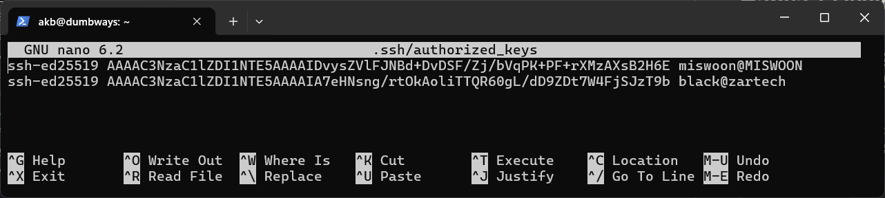
#### Satu Public Key akan di-_comment_ untuk memblok akses:
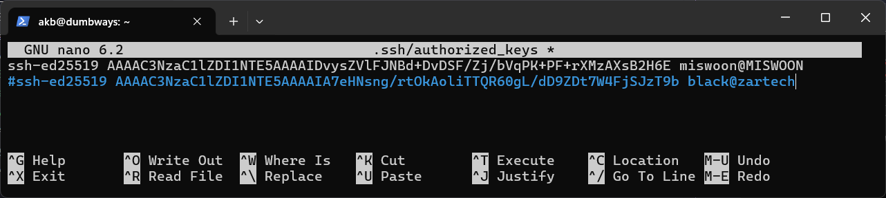

#### Pada gambar di atas, diketahui terdapat 2 Public Key yang diizinkan untuk mengakses Server melalui SSH, jika hanya satu yang diizinkan (Public Key satunya dicomment) maka device yang lain yang berupa Virtual Machine tidak akan dapat mengakses SSH meskipun dia punya Public Key untuk mengakses Server


## 3. Uji coba dengan 2 device:
### Device 1 (Host OS, Hostname ➡️ miswoon):
```
ssh vm-dumbways
```
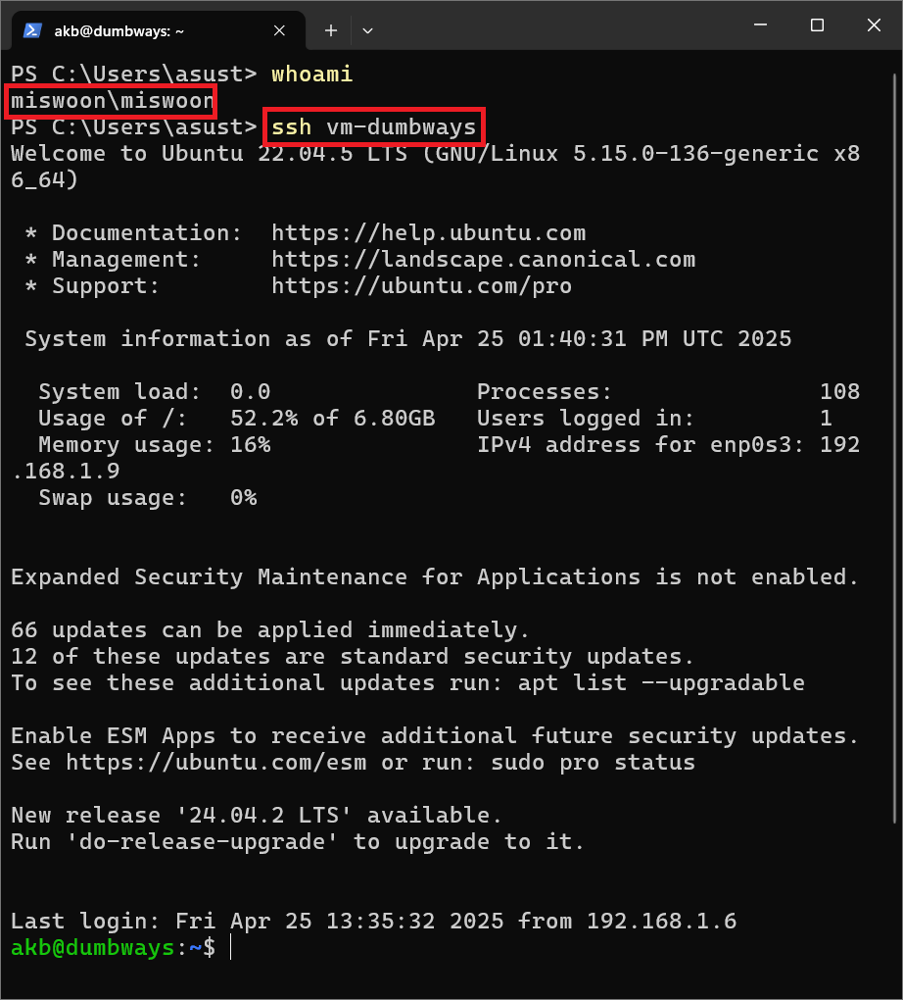

### Device 2 (VM, Hostname ➡️ black):
```
ssh akb@192.168.1.9 -p 6969
```
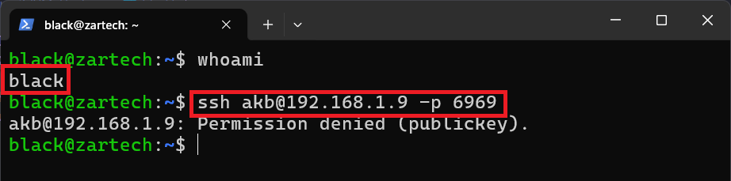

Berdasarkan uji coba tersebut diketahui bahwa hanya Device dengan hostname 'miswoon' yang diizinkan untuk mengakses server melalui SSH menggunakan Public Key. Device yang berupa VM dengan hostname 'black' tidak diizinkan untuk mengakses server sebab meskipun Public Key-nya tersimpan di file `authorized_keys` namun Public Key tersebut di-_comment_ sehingga server tidak membaca/mengenali host tersebut untuk diberikan akses ke server.

## Kelebihan dan Kekurangan Metode Ini
### Kelebihan ✨
- Metode ini lebih aman dari serangan Brute Force karena menggunakan Public Key daripada password untuk login SSH.  
- IP dari Client SSH dapat dinamis (menggunakan Protokol DHCP) dan dapat digunakan pada device lain asalkan memiliki pasangan Public Key dan Private Key

### Kekurangan 💥
  Karena akses ke server SSH dapat dilakukan dengan pasangan Public Key dan Private Key, maka diperlukan upaya ekstra untuk menjamin keamanan Private Key. Salah satu cara yang dapat dilakukan dengan menambahkan `passphrase` saat generate key tersebut.