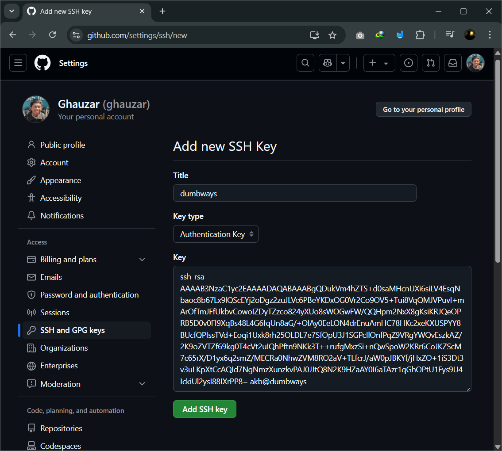
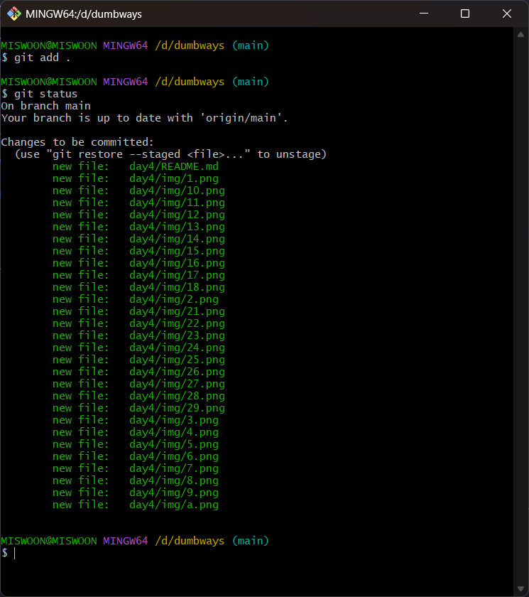
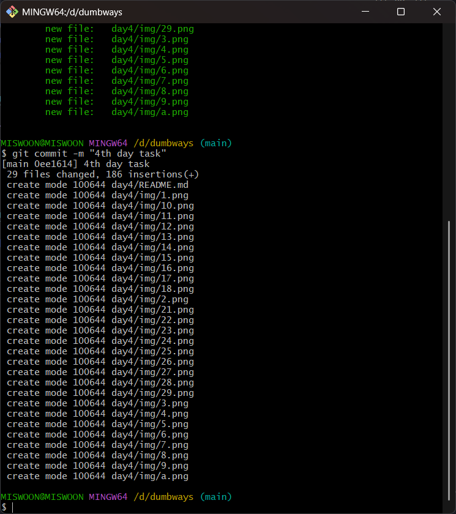

# Version Control System

## Git
Git adalah salah satu version control system yang dapat mencatat perubahan pada file-file yang diunggah pada suatu repositori online dan digunakan untuk berkoordinasi dalam pekerjaan yang melibatkan banyak orang, yang pada umumnya pada bidang pengembangan perangkat lunak. Git memudahkan praktisi bidang IT mendistribusikan hasil pekerjaan mereka pada tim dan mengatur versioning aplikasi yang lebih baku. Git juga mendukung tim DevOps dalam mengelola repositori seperti kapan hasil kerja developer masuk pada tahap test, staging, dan production. Beberapa command yang sering digunakan dalam git adalah sebagai berikut.

### Perintah Dasar Git
| Command | Fungsi |
| :--- | :--- |
| `git init`| Membuat repositori baru |
| `git clone <url>`| Mengunduh repositori dari remote |
| `git status`| Melihat status file yang diubah atau belum di-commit |
| `git add <file>`| Menambahkan file ke staging area  |
| `git commit -m "pesan"`| Menyimpan perubahan ke repositori lokal |
| `git log`| Melihat riwayat commit |
| `git restore <file>`| Mengembalikan file ke versi terakhir dari commit terakhir |
| `git restore --staged`| Menghapus file dari staging area, tapi tidak mengubah isi file |


### Bekerja dengan Remote
| Command | Fungsi |
| :--- | :--- |
| `git remote add origin <url>`| Menghubungkan repo lokal ke remote |
| `git push origin <branch>`| Mengirim perubahan ke remote |
| `git pull origin <branch>`| Mengambil dan menggabungkan perubahan dari remote |
| `git fetch`| Mengambil semua update dari remote tanpa merge |
| `git remote -v`| Melihat daftar remote repositori |

### Branching dan Merging
| Command | Fungsi |
| :--- | :--- |
| `git branch`| Melihat daftar branch |
| `git branch <nama>`| Membuat branch baru |
| `git checkout <branch>`| Pindah ke branch tertentu |
| `git checkout -b <nama>`| Membuat dan langsung berpindah ke branch baru |
| `git merge <branch>`| Menggabungkan branch ke branch aktif |
| `git rebase <branch>`| Menyusun ulang riwayat commit |


## Membuat Repositori Github dan Melakukan `push` ke Repositori
### 1. Konfigurasi username dan email untuk akun Github
```
git config --global user.name ghauzar
git config --global user.email "<email>"
git config --list
```


### 2. Cek apakah Public Key dan Private Key sudah ada (belum ada)
```
cd .ssh
ls
```


### 3. Buat pasangan Public Key dan Private Key
```
ssh-keygen
```


### 4. Tampilkan isi Public Key dan salin key tersebut
```
cat id_rsa.pub
```


### 5. Pada Github, masuk ke Settings ➡️ SSH and GPG keys ➡️ New SSH Key


### 6. Isi Title, Key type, dan tempel Public Key dari server ke field key ➡️ Add SSH Key


### 7. Github akan mengonfirmasi dengan meminta password login akun Github, mengisi password dan tekan Confirm


### 8. SSH Key berhasil ditambahkan ke akun Github dengan nama "dumbways"


### 9. Uji koneksi dari terminal SSH ke server Github. Jika muncul pesan seperti berikut maka koneksi berhasil.
```
ssh git@github.com -T
```


### 10. Buat direktori "dumbways" ➡️ buat "file1", "file2" lalu dilakukan cat pada dua file tersebut menjadi "file3"
```
mkdir dumbways
cd dumbways
cat > file1
cat > file2
cat file1 file2 > file3
ls
```


### 11. Buat repositori lokal baru dengan nama "dumbways-batch-23"
```
git init dumbways-batch-23
```


### 12. Salin file1, file2, dan file3 ke direktori "dumbways-batch-23"
```
cp file1 dumbways-batch-23/file1
cp file2 dumbways-batch-23/file2
cp file3 dumbways-batch-23/file3
```


### 13. Buat file kosong bernama "file4"
```
touch file4
ls -la
```


### 14. Buat file `.gitignore` untuk menghimpun nama-nama file atau direktori yang diabaikan git untuk diunggah ke repositori Github
```
nano .gitignore
```


### 15. Dapat dilihat jika dicek dengan command `ls -la` "file4" ada, tetapi ketika dijalankan perintah `git status`, "file4" tidak ada sebab file tersebut diabaikan git karena file "file4" tertulis namanya di file `.gitignore`
```
git status
```


### 16. Mengubah status setiap file menjadi kelas "staging"
```
git add .
git status
```


### 17. Melakukan commit dan memberikan pesan "First commit"
```
git commit -m "First commit"
```


### 18. Apabila ada file yang dilakukan perubahan setelah commit, maka dapat mengembalikan isi file sesuai dengan isi file saat commit sebelumnya menggunakan `git restore`
```
git restore file1
```


### 19. Buat repositori baru di Github dengan nama yang sama dengan repositori lokal yaitu "dumbways-batch-23"


### 20. Tambahkan remote sesuai link dan pastikan memilih SSH di atas sebab perubahan akan dikirim ke repositori Github menggunakan command SSH
```
git remote add origin git@github.com:ghauzar/dumbways-batch-23.git
```


### 21. Jika ingin mengganti branch yang tersedia, dapat menggunakan command berikut:
```
git branch -M <branch>
```


### 22. Mengirim perubahan ke remote
```
git push -u master
```


### 23. Setelah selesai, maka repositori Github "dumbways-batch-23" menjadi seperti berikut:


# Manage Tugas dengan Terminal
## 1. Memeriksa status dari repositori lokal "dumbways"
```
git status
```


## 2. Diketahui bahwa terdapat 1 direktori dengan status "untracked", untuk mengubah status dari direktori tersebut menjadi "staging area" maka diperlukan command berikut.
```
git add .
```


## 3. Melakukan commit dan memberikan pesan "4th day task"
```
git commit -m "4th day task"
```



## 4. Terdapat modifikasi file README.md dan penambahan gambar baru, oleh karena itu dapat mengubah status menjadi stage dengan command berikut:
```
git add .
```

## 4. Mengirim perubahan ke repositori Github
```
git push -u origin main
```
