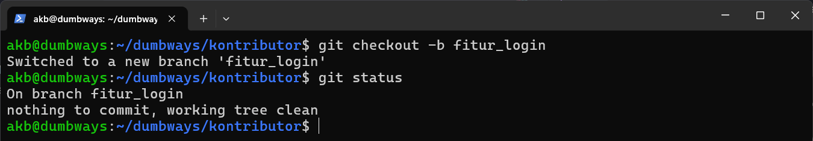

# Membuat Repositori `dumbways-batch-23` Menjadi Private
### 1. Membuka repositori [dumbways-batch-23](https://github.com/ghauzar/dumbways-batch-23) ➡️ Pilih Settings ➡️ Muncul halaman Settings untuk repositori tersebut, scroll sampai menemukan tampilan sebagai berikut, lalu pilih 'Change visibility' ➡️ 'Change to private'


### 2. Klik 'I want to make this repository private'


### 3. Klik 'I have read and understand these effects'


### 4. Klik 'Make this repository private'


### 5. Memasukkan password akun Github untuk konfirmasi


### 6. Setelah berhasil maka repositori `dumbways-batch-23` sudah menjadi Private


# Demonstrasi Git Pull Request
## 1. Clone repositori `dumbways-batch-23` ke direktori lokal yang berbeda seolah sebagai kontributor
```
git clone git@github.com:ghauzar/dumbways-batch-23.git kontributor
``` 


## 2. Masuk ke direktori `kontributor` dan buat branch baru
```
cd kontributor
```
```
git checkout -b fitur_login
```
```
git status
```


## 3. Buat perubahan pada salah satu file yang tersedia, misal file1
```
ls 
```
```
cat file1
```
```
nano file1
```
```
cat file1
```
```
git status
```


## 4. Diketahui bahwa `file1` telah mengalami perubahan (modified), melakukan staging file1, commit, dan push kembali ke repositori dengan branch 'fitur_login'
```
git add .
```
```
git commit -m "Buat halaman login"
```
```
git push origin fitur_login
```


## 5. Buka repositori `dumbways-batch-23` dan akan muncul tombol 'Compare & pull request'. Saat ini seolah pemilik repositori akan meninjau pull request sehingga tombol tersebut perlu diklik


## 6. Open pull request dengan mengisi title dan description ➡️ klik 'Create pull request'


## 7. Jika pemilik repositori ingin melihat perubahan pada file yang diajukan kontributor, dapat melihat pada tab 'Files changed'


## 8. Setelah Open Pull request, pemilik repositori dapat langsung melakukan merge asal tidak ada konflik dengan base branch dengan klik 'Merge pull request'.


## 9. Mengisi informasi untuk melakukan Merge ➡️ Confirm merge 


## 10. Pull request yang telah dikonfirmasi untuk Merge akan memiliki tampilan sebagai berikut


## 11. (Opsional) jika pull request sudah dilakukan merge dengan base branch, maka dari kontributor dapat membersihkan branch `fitur_login` 
```
git checkout main
```
```
git pull origin main
```
```
git branch -d fitur_login
```


## Dari pemilik repositori:
```
git push origin --delete fitur_login
```


## Sebelum branch `fitur_login` dihapus:


## Setelah branch `fitur_login` dihapus:

