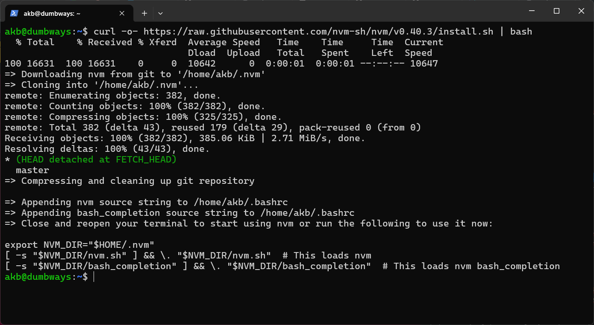
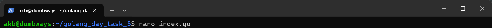
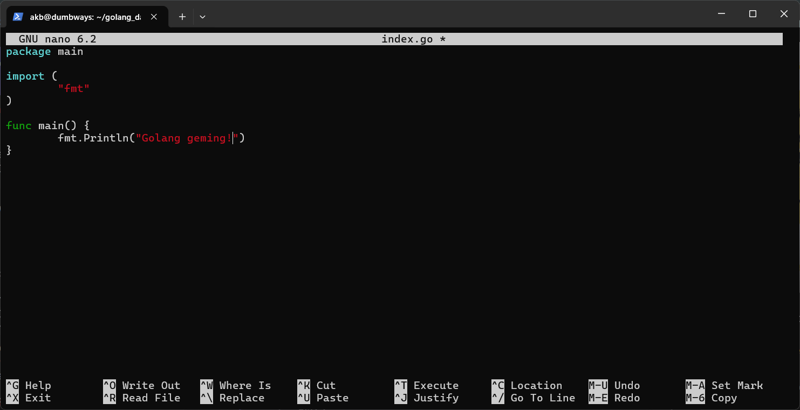

# Deploy NodeJS di Ubuntu
## 1. Install NodeJS di Ubuntu dengan pertama download nvm melalui script bash berikut ([URL Script](https://nodejs.org/en/download)):
```
curl -o- https://raw.githubusercontent.com/nvm-sh/nvm/v0.40.3/install.sh | bash
```


## 2. Setelah langkah 1 selesai, dapat merefresh `bash` dengan kode berikut:
```
exec bash
```

## 3. Clone repository [wayshub-frontend](https://github.com/dumbwaysdev/wayshub-frontend#)
```
git clone git@github.com:dumbwaysdev/wayshub-frontend.git
```


## 4. Cek versi NodeJS, `nvm`, dan `npm`. Install Node 13 yang sesuai dengan project `wayshub-frontend`
```
cd wayshub-frontend
```
```
ls
```
```
node -v && nvm current && nvm -v
```
```
nvm install 13
```
```
node -v && nvm current && nvm -v
```


## 5. Jalankan server dengan perintah berikut:
```
npm start
```

## Diketahui bahwa node_module belum ada, sehingga perlu menginstal beberapa modules terlebih dahulu.

## 6. Install modules:
```
npm install
```


## 7. Setelah instal modules, dapat menjalankan server:
```
npm start
```


## 8. Buka di browser dengan alamat `192.168.1.9:3000`


# Deploy Python Flask di Ubuntu
## 1. Install pip sebagai package manager dari Python
```
sudo apt instal python3-pip
```


## 2. Install package `Flask` yang digunakan untuk membuat aplikasi web pada Python


## 3. Buat direktori `python_day_task_5`, cek apakah Flask sudah terinstal, kemudian buat 1 file Python, 
```
mkdir python_day_task_5 && cd python_day_task_5
```


## 4. Memastikan `Flask` telah terinstal:
```
pip list
```


## 5. Buat sebuah file script python dengan nama `index.py`
```
nano index.py
```
## Masukkan snippet kode berikut:
```
from flask import Flask

app = Flask(__name__)

@app.route('/')
def index():
    return '<h1>Ghauzar Andhika Akbar! 👋</h1>'

app.run(host='0.0.0.0', port=5000)
```


## 6. Jalankan server dengan mengeksekusi command berikut:
```
python3 index.py
```


## 7. Akses URL `192.168.1.9:5000` di browser


# Deploy app menampilkan text "Golang geming!"
## 1. Buat direktori `golang_day_task_5` dan pindah ke direktori tersebut
```
mkdir golang_day_task_5 && cd golang_day_task_5
```


## 2. Unduh instalasi Golang dari link [ini](https://go.dev/dl/) dengan command berikut:
```
wget https://go.dev/dl/go1.24.2.linux-amd64.tar.gz && ls
```


## 3. Masuk ke mode root untuk mengupgrade Golang secara manual dengan command berikut:
```
sudo su
```
```
rm -rf /usr/local/go && tar -C /usr/local -xzf go1.24.2.linux-amd64.tar.gz
```
```
exit
```


## 4. Menambahkan direktori `/usr/local/go/bin` ke dalam variabel lingkungan PATH


## 5. Cek apakah Golang sukses diinstal dengan memeriksa versinya:
```
go version
```


## 6. Buat file script bernama `index.go`
```
nano index.go
```

## Masukkan snippet kode berikut:
```
package main

import (
        "fmt"
)

func main() {
        fmt.Println("Golang geming!")
}
```


## 7. Jalankan script Golang dengan command berikut:
```
go run index.go
```


