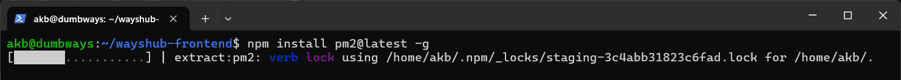
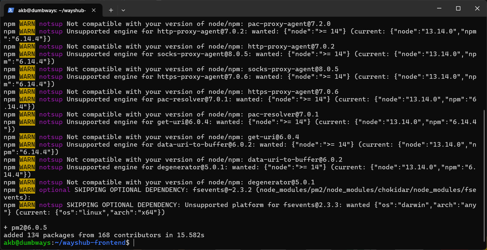
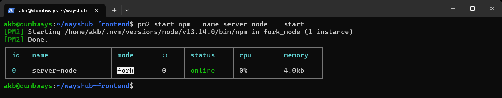
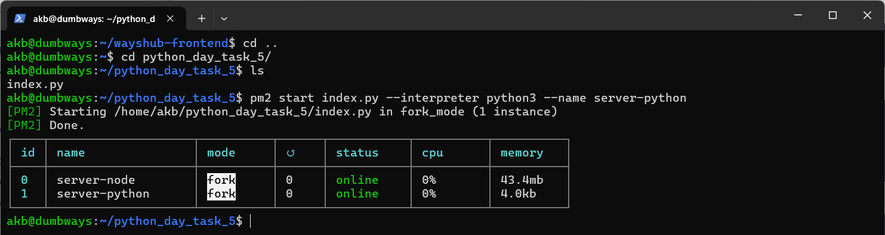
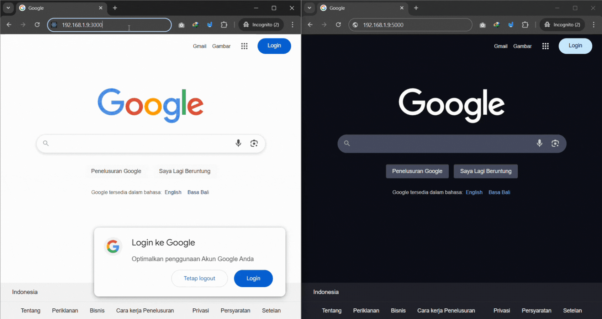
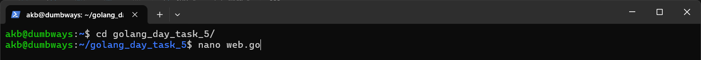
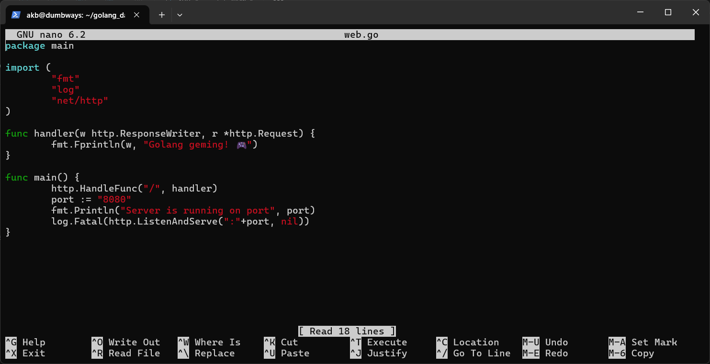
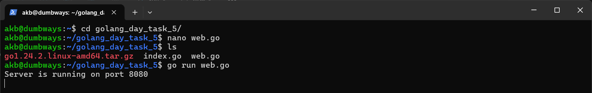
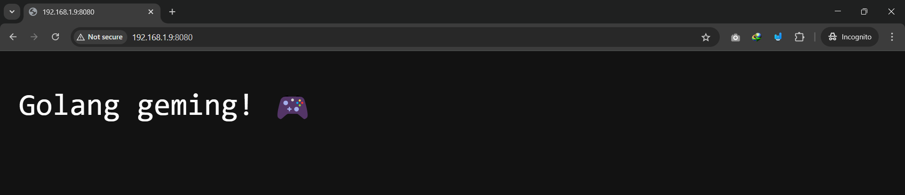

# Membuat Server NodeJS dan Python Flask Berjalan di Background
## 1. Install [pm2](https://pm2.keymetrics.io/) dengan perintah berikut:
```
npm install pm2@latest -g
```



## 2. Menjalankan server NodeJS pada direktori `wayshub-frontend` dengan menggunakan `pm2` dan menamai proses ini sebagai `server-node` untuk dijalankan di background:
```
cd wayshub-frontend
```
```
pm2 start npm --name server-node -- start
```


## 3. Pindah ke file server Python berada di direktori `python_day_task_5`, menjalankan server Python dengan nama proses `server-python` untuk dijalankan di background:
```
cd ..
```
```
cd python_day_task_5
```
```
ls
```
```
pm2 start index.py --interpreter python3 --name server-python
```


## Hasil dari eksekusi server NodeJS dan Python adalah sebagai berikut, kedua server dapat berjalan di background:



# Golang Bisa Dibuka di Browser
## 1. Menuju ke direktori `goloang_day_task_5`, kemudian membuat file yang menjadi server dari bahasa Golang dengan nama `web.go`
```
cd golang_day_task_5
```
```
nano web.go
```


## 2. Memasukkan kode snippet web server bahasa Go sederhana seperti kode berikut:
```
package main

import (
        "fmt"
        "log"
        "net/http"
)

func handler(w http.ResponseWriter, r *http.Request) {
        fmt.Fprintln(w, "Golang geming! 🎮")
}

func main() {
        http.HandleFunc("/", handler)
        port := "8080"
        fmt.Println("Server is running on port", port)
        log.Fatal(http.ListenAndServe(":"+port, nil))
}
```


## 3. Simpan file `web.go` kemudian jalankan dengan perintah:
```
go run web.go
```
## Maka output akan  seperti ini 
                                            


## 4. Buka browser dan akses ke alamat `192.168.1.9:8080`



