# Reverse Proxy
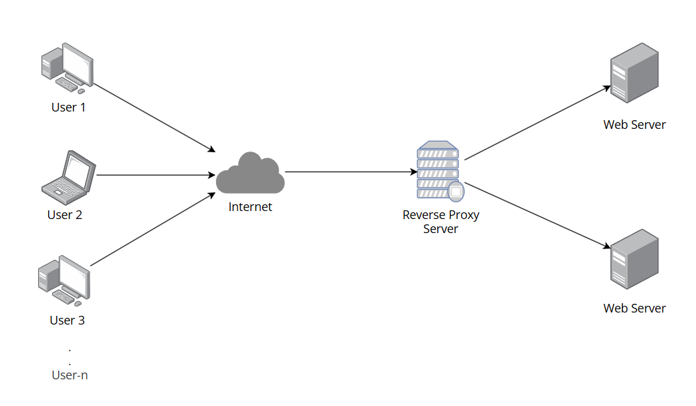

`Reverse proxy` adalah sebuah server yang berada di tengah-tengah antara komputer client dan web server di mana posisi  dari server proxy tersebut di depan web server yang ingin diakses client. Metode ini dapat mencegah komputer client berkomunikasi secara langsung dengan web server serta menyembunyikan alamat IP asli dari web server sehingga meminimasi serangan terhadap web server. Perbedaan dengan `forward proxy` adalah posisi server proxy berada di depan client, sementara posisi dari server `reverse proxy` berada di depan server. Cara kerja dari `Reverse proxy` adalah sebagai berikut.

    1.  Komputer Client (user) mengirimkan request ke server proxy
    2.  Server proxy memastikan bahwa permintaan user merupakan request yang aman dan tidak mencurigakan, kemudian meneruskan request tersebut ke web server yang tepat.
    3.  Web server memberikan response ke server proxy lalu diteruskan kembali ke komputer client (user).

Referensi: [Cloudflare](https://www.cloudflare.com/learning/cdn/glossary/reverse-proxy/)

# Membuat Reverse Proxy di Ubuntu Server
## 1. Konfigurasi domain di file hosts di Host OS (Windows) yang terletak di direktori `C:\Windows\System32\drivers\etc`. Pastikan mengedit file tersebut dengan permission sebagai Administrator.
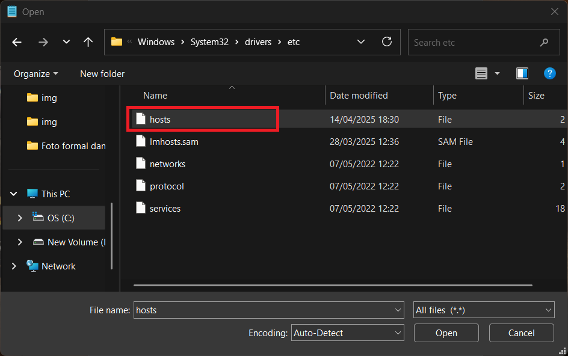
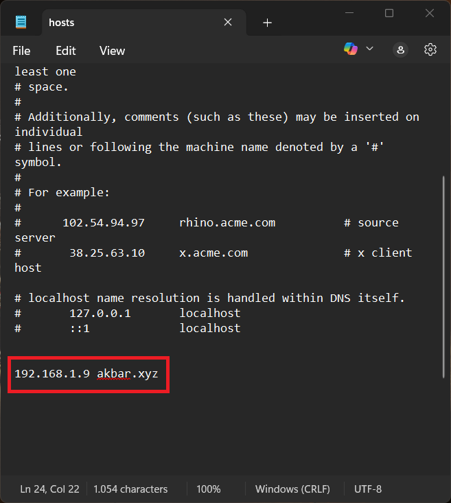

## 2. Buka Ubuntu server melalui ssh, update repositori Ubuntu, lakukan instalasi nginx (jika belum). 
```
sudo apt update
```
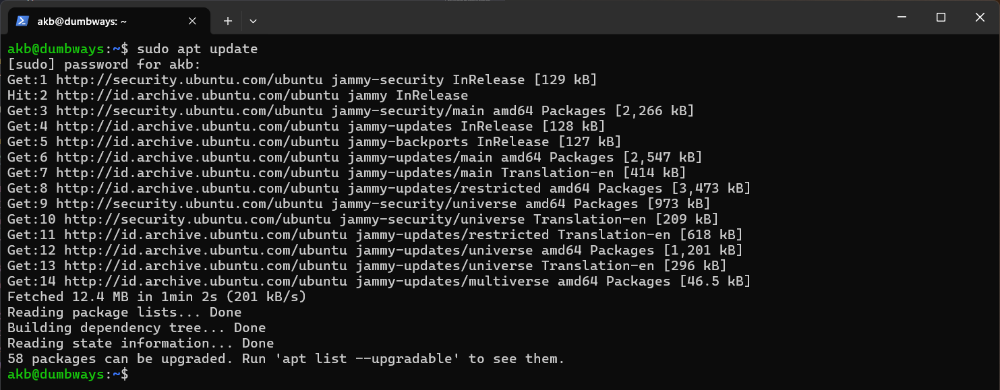
```
sudo systemctl status nginx
```
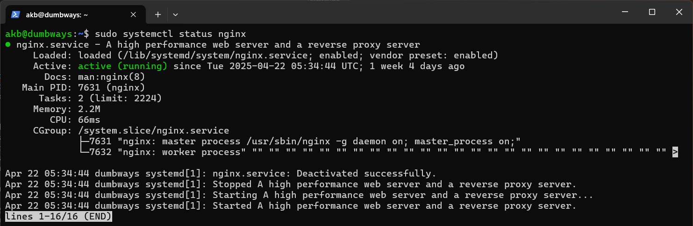

## 3. Cek di browser Host OS dengan alamat `akbar.xyz`. 
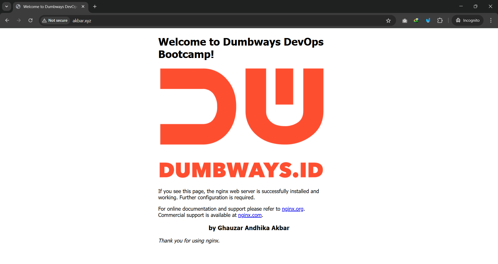
## Jika terjadi infinite loading, kemungkinan port 80 dan/atau 443 belum dibuka oleh ufw. Berikan izin akses pada kedua port tersebut di ufw. dan cek apakah di browser sudah dapat mengakses domain `akbar.xyz` sesuai konfigurasi awal.
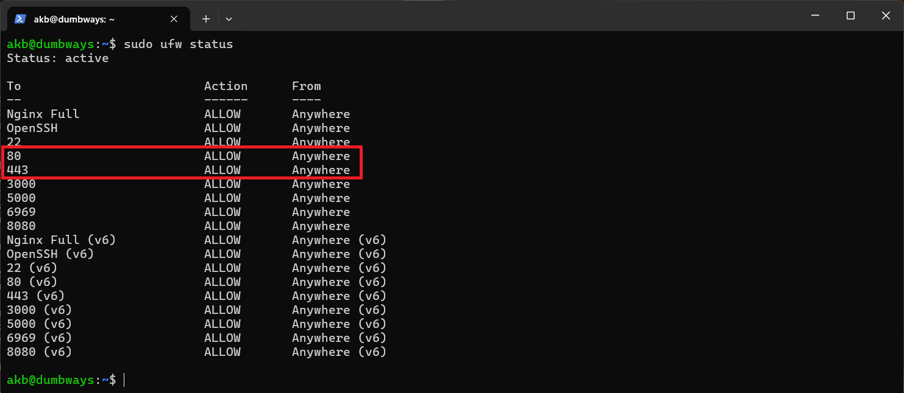

## 4. Pindah ke direktori `/etc/nginx/sites-enabled` untuk melakukan konfigurasi domain `akbar.xyz` yang diarahkan ke aplikasi `wayshub-frontend` yang berjalan di alamat `http://192.168.1.9` dengan port `3000`
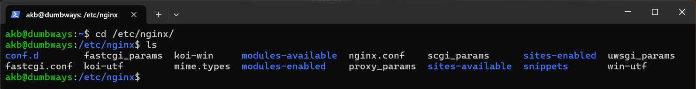

## 5. Buat file konfigurasi baru `akbar.conf` dan mengisi file tersebut dengan kode snippet berikut:
```
server {
    server_name akbar.xyz;
  
        location / {
             proxy_pass http://192.168.1.9:3000;
    }
}
```
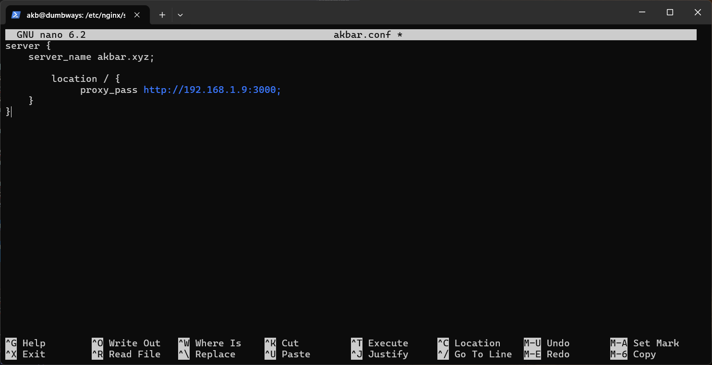
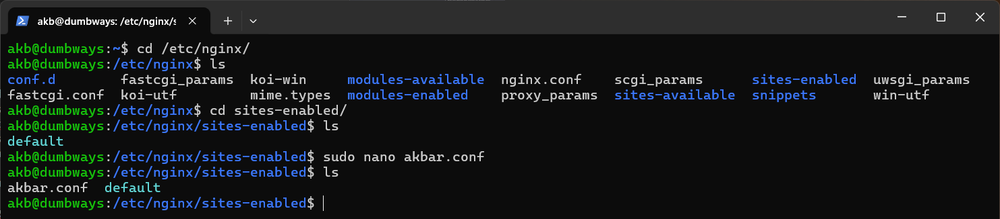

## 6. Setelah selesai membuat dan menyimpan file `akbar.conf` jalankan command berikut untuk menguji apakah ada error pada konfigurasi domain tersebut. Kemudian lakukan restart server nginx, dan cek status dari service nginx
Cek error pada konfigurasi nginx: 
```
sudo nginx -t
```
Restart nginx:
```
sudo systemctl reload nginx
```
Cek status service nginx:
```
sudo systemctl status nginx
```
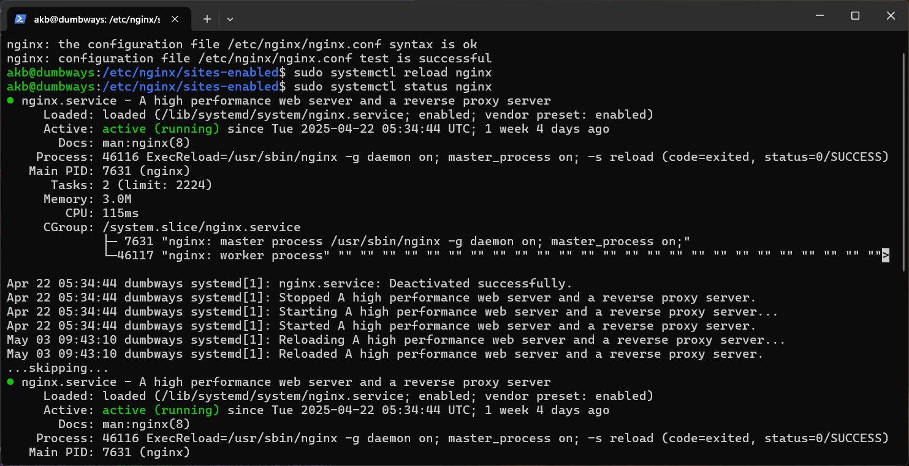


## 7. Cek dengan browser Host OS apakah domain `akbar.xyz` sudah dapat mengarahkan ke alamat `192.168.1.9` port `3000` sesuai dengan konfigurasi untuk membuka aplikasi `wayshub-frontend`
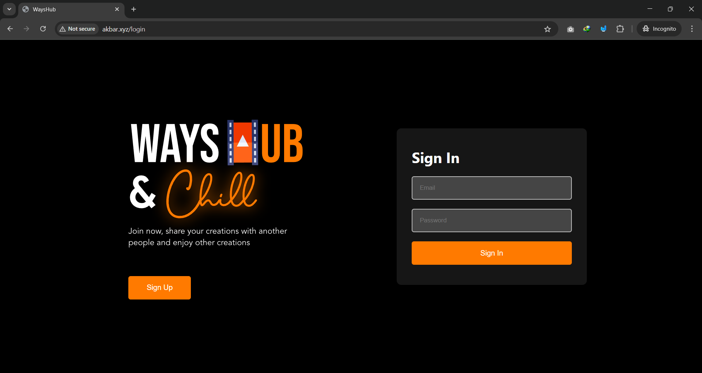
