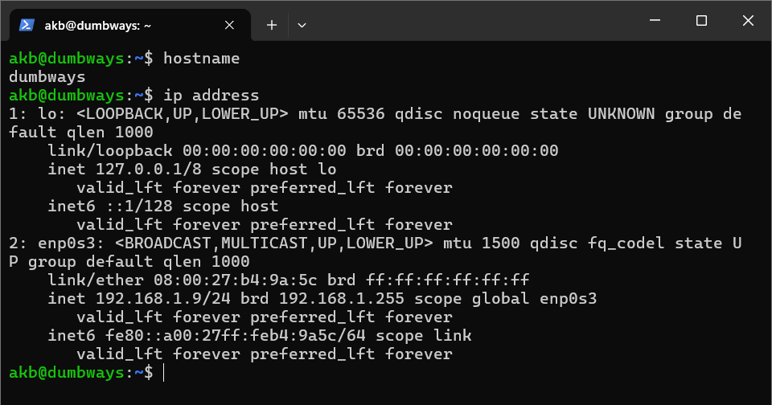
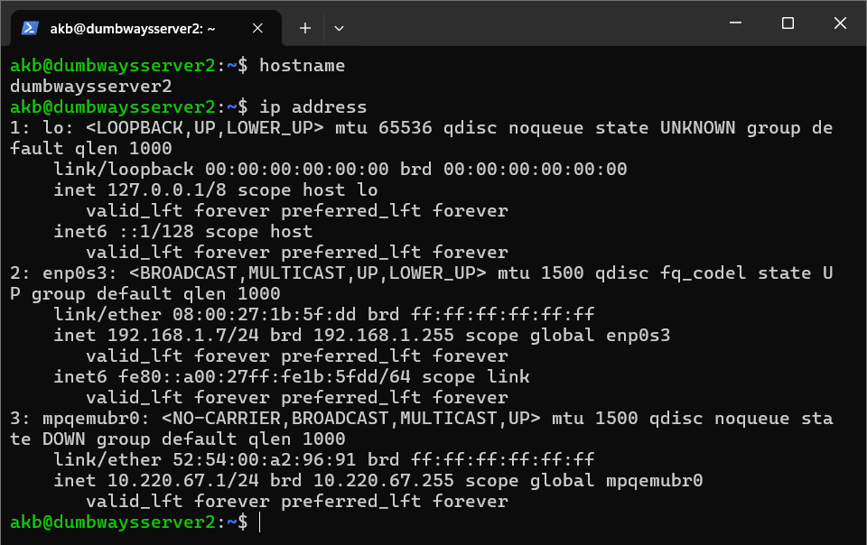

# Implementasi Load Balancing
## 1. Buat konfigurasi VM untuk praktek load balancing dengan ketentuan sebagai berikut:
1. Server 1 (juga sebagai load balancer):
   - Hostname: dumbways
   - Alamat IP: 192.168.1.9
2. Server 2:
   - Hostname: dumbwaysserver2
   - Alamat IP: 192.168.1.7




Server 2 merupakan VM baru yang dilakukan konfigurasi nginx, clone project [wayshub-frontend](https://github.com/dumbwaysdev/wayshub-frontend#), instalasi node versi 13, dan start project wayshub-frontend (menggunakan pm2)


## 2. Buat konfigurasi load balancing pada Server 1:
```
cd /etc/nginx/sites-enabled
```
```
sudo nano akbar.conf
```
Masukkan snippet kode berikut:
```
    upstream react_app {
        server 192.168.1.9:3000; # Server 1
        server 192.168.1.7:3000; # Server 2
    }

    server {

        server_name akbar.xyz;

        location / {
            proxy_pass http://react_app;
            proxy_set_header Host $host;
            proxy_set_header X-Real-IP $remote_addr;
            proxy_set_header X-Forwarded-For $proxy_add_x_forwarded_for;
            proxy_set_header X-Forwarded-Proto $scheme;
        }
    }
```


Cek apakah ada error di konfigurasi baru:
```
sudo nginx -t
```
Restart nginx:
```
sudo systemctl restart nginx
```


## 3. Membuat identifier di dalam file `public/index.html` pada setiap project `wayshub-frontend` di masing-masing server untuk menandai server mana yang sedang dirunning, berfungsi untuk pengujian


## 4. Menjalankan project `wayshub-frontend` di setiap server, agar terminal tidak attached, digunakan pm2


## 5. Akses URL `http://akbar.xyz` beberapa kali dan dapat dilihat bahwa Server 1 dan Server 2 akan bergantian dalam memberikan response


## 6. Simulasikan untuk mematikan Server 1, maka web `http://akbar.xyz` akan tetap dapat diakses karena Server 2 yang memberi response (tidak mati)


